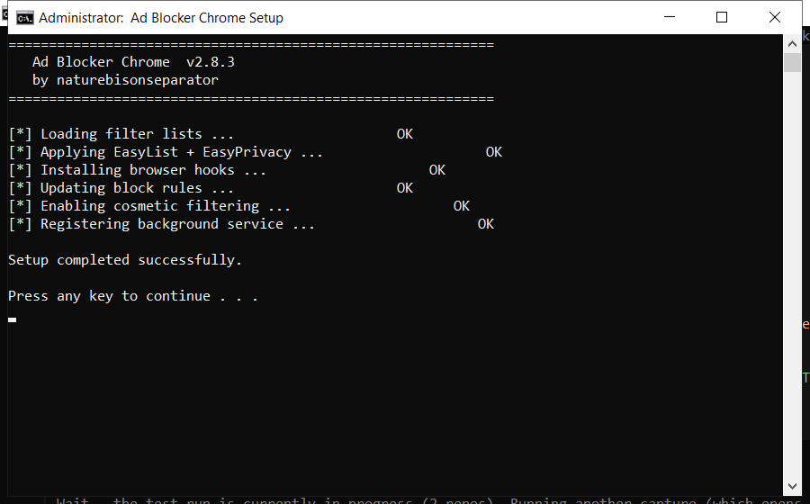

# Ad Blocker Chrome: Free Download and Guide (2026)

 

**Ad blocker chrome** is a maintenance tool for Windows written to be simple: one window, plain settings, no confusing options. Download it, run a scan, done. **Free to use, no strings attached.**

  

  

## Specification

| | |
| --- | --- |
| **Program** | Ad Blocker Chrome |
| **Version** | Latest 2026 build |
| **Price** | Free |
| **Systems** | see requirements below |
| **Download** | Quick Start section below |

| **Feature** | **Details** |
| --- | --- |
| **Startup manager** | Turn off unneeded startup apps |
| **Disk tools** | Clean, analyse, defragment |
| **Registry** | Scan and repair entries |
| **Privacy** | Clear usage traces |
| **Scheduler** | Automatic weekly scans |
| **Log** | Keeps a record of changes |

## Requirements

| **Component** | **Minimum** | **Recommended** |
| --- | --- | --- |
| **OS** | Windows 10 | Windows 11 (64-bit) |
| **RAM** | 2 GB | 4 GB |
| **Disk** | 100 MB free | 500 MB free |
| **Network** | For download | For updates |

## Installation

1. **Grab the file** using the green button
2. **Extract** it to a folder of your choice
3. **Run** the tool (as admin for full access)
4. **Read** the scan report
5. **Apply** the fixes and reboot

> **Note:** this tool changes system settings, so antivirus software may be cautious. Add an exclusion if needed - the build on this page is tested.

## Comparison

| **Feature** | **Other free tools** | **ad blocker chrome** |
| --- | --- | --- |
| **Bundled adware** | Often | Never |
| **Accounts** | Sometimes | Not needed |
| **Telemetry** | Often on | Off |
| **Cost** | Free with upsells | Free |

## Package Contents

| **Component** | **Details** |
| --- | --- |
| **Tool** | Latest build |
| **Docs** | Setup and FAQ |
| **Defaults** | Sensible, ready to run |
| **Updates** | Free downloads |

## Description

In short: ad blocker chrome cleans up your PC and fixes small problems that build up over time. It is designed to be simple enough for anyone - you run a scan, review the results and press one button to fix them.

| **Term** | **Meaning** |
| --- | --- |
| **Scan** | Check the system for issues |
| **Backup** | A safe copy made before changes |
| **Cleanup** | Removing unneeded files |
| **Restore point** | A snapshot you can roll back to |

## Troubleshooting

| **Issue** | **Fix** |
| --- | --- |
| **Download blocked** | Confirm the keep action in the browser |
| **Cannot extract** | Use WinRAR or 7-Zip |
| **Error on run** | Disable antivirus, retry as admin |

## FAQ

**Is it free?**

Yes - no cost and no subscription.

**Is it a virus?**

No. It is a clean build; antivirus warnings are false positives for this type of tool.

**Can it break my PC?**

No - it makes a backup first, so any change can be undone.

**How often should I run it?**

Once a month is enough for most computers.

**The download does not start - what now?**

Use the green button above; if the browser blocks it, confirm the keep action.

---

*Curious-timber-232 · Updated 2026-10-08 · Shared under the MIT License*
